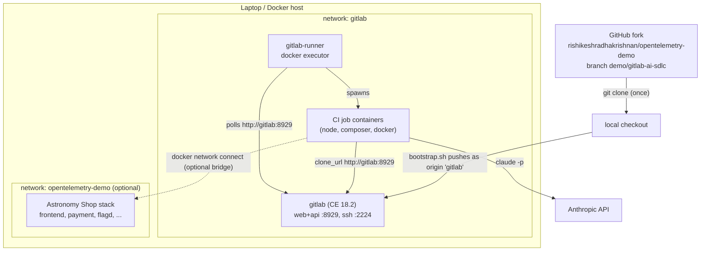

# GitLab AI-Native SDLC Demo

A self-contained, laptop-local demo of an **AI-native software development
lifecycle** on GitLab, built on top of the OpenTelemetry Astronomy Shop demo
(this repo, pinned to upstream v2.2.0). It follows the practices in
[The AI-Native SDLC playbook](https://claude.com/blog/the-ai-native-sdlc-playbook):
the SDLC as a **loop of automatically-triggered plays** with AI embedded at
each stage and **humans owning the gates**.

Everything runs on your machine: a GitLab CE instance, a GitLab Runner, and
(optionally) the Astronomy Shop itself. The only external dependency is the
Anthropic API for the Claude CI jobs.

## Architecture



ASCII fallback:

```
GitHub fork ──clone──► local checkout ──bootstrap push──► GitLab CE :8929
                                                             ▲    ▲
                                              polls jobs ────┘    │ MR notes / fix MRs
                                            gitlab-runner ──► CI job containers ──► Anthropic API
                                                                  │
                                       (optional docker network bridge)
                                                                  ▼
                                                    Astronomy Shop stack (flagd, payment, ...)
```

Flow: **GitHub fork → local GitLab origin → CI pipeline → Claude review /
autofix jobs → human merge gate**.

## Prerequisites

- Docker Desktop (or engine + compose plugin). **Memory: GitLab CE alone
  needs ~4GB+; allow 12GB+ if you run GitLab plus a trimmed Astronomy Shop
  stack together.**
- `git`, `curl`, `python3` on the host (bootstrap uses them).
- An **Anthropic API key** for the `claude-review` / `claude-autofix` jobs.
- Free host ports: `8929` (GitLab web), `2224` (GitLab ssh).

## First run

```bash
# 1. Clone the demo branch (skip if you have this checkout already)
git clone -b demo/gitlab-ai-sdlc https://github.com/rishikeshradhakrishnan/opentelemetry-demo
cd opentelemetry-demo/demo/gitlab

# 2. Optional but recommended: export the key so bootstrap wires it into CI
export ANTHROPIC_API_KEY=sk-ant-...        # never committed anywhere
# Optional: override the demo-only root password (default: demopassword123!)
export GITLAB_ROOT_PASSWORD='my-demo-password-42!'

# 3. One command up: starts GitLab + runner, waits for health (3-5+ min!),
#    creates group/project/runner/CI variables, pushes the code into GitLab.
./up.sh
```

Then:

1. Log in at **http://localhost:8929** as `root` / your
   `GITLAB_ROOT_PASSWORD` (default `demopassword123!` — demo-only, never a
   real secret).
2. Open **demo/opentelemetry-demo → Build → Pipelines**: the branch pipeline
   for `demo/gitlab-ai-sdlc` is already running.
3. Watch `test:payment` fail (the planted bug, below) and `claude-autofix`
   open a fix MR. Open any MR to see `claude-review` post its findings.

Optional: start the Astronomy Shop itself from the repo root
(`docker compose up -d` — or `docker compose -f docker-compose.minimal.yml up
-d` on smaller machines) and bridge the networks as described in
`docker-compose.gitlab.yml`.

Day-2 commands: `./down.sh` (stop, keep state), `./up.sh --no-bootstrap`
(resume), `./reset.sh` (wipe — see below).

## Demo storyline, mapped to the playbook

The playbook's core claim: the six familiar SDLC stages (plan, design, build,
test, deploy, maintain) survive, but become a **loop** where AI plays trigger
each other and humans keep the approval gates. Each demo beat below cites the
practice it demonstrates.

| # | Demo beat | Playbook practice |
|---|-----------|-------------------|
| 1 | The pipeline, prompts, and runbooks live in the repo (`.gitlab-ci.yml`, `demo/gitlab/`) | "Repo as the source of truth": process artifacts are versioned markdown/config in one system with one timestamp authority |
| 2 | Plant a fault: the payment service carries a hard-coded 30% "Connection timeout" in `src/payment/charge.js`, and 15 flagd flags (`src/flagd/demo.flagd.json`) inject runtime faults — e.g. set `paymentFailure` to a % variant in the flagd UI (http://localhost:8080/feature after starting the shop) | Maintain-stage plays are triggered by real failure signals; fault injection stands in for production incidents |
| 3 | Open an MR (e.g. touch `src/payment/`) → `claude-review` reviews the diff and posts evidence-cited, severity-rated findings as an MR note | "When a PR is opened, multiple agents automatically review it", each **scoped narrowly** and required to **prove findings with evidence** (the practice that raised substantive review comments 16%→54% at Anthropic) |
| 4 | The `test:payment` job fails: `charge.test.js` stubs all flags off and shows valid charges still failing ~30% of the time | Agentic CI as the verification gate: fast automated tests on every change, only representative services so "build collapses to hours" (here: minutes) |
| 5 | `claude-autofix` fires **on failure**, reproduces the test, root-causes the planted line, applies the smallest fix, re-runs the test, pushes `ai-fix/<sha>` and opens an MR | The auto-fix play: "reviews the diff, generates missing tests, attempts to fix failures... without human intervention", running unattended with guardrails (scoped prompt, `acceptEdits`, least-privilege project token) |
| 6 | A human reviews and merges the fix MR; the pipeline goes green | Humans "direct, set intent, and own final approval" — every automated play ends at a human gate |
| 7 | `./reset.sh --tree original --up` restores the pristine state for the next audience | The loop closes: automated handover back to a known-good state (the repo's `original` branch + `reset-to-branch.sh`) |

Existing repo assets this demo builds on: the **15 flagd fault-injection
flags**, the **planted payment bug** (`Math.random() < 0.3` throw in
`charge.js`), the pristine **`original` branch** with `reset-to-branch.sh`,
and the GitHub-side Claude workflows (`.github/workflows/claude*.yml`) — the
GitLab pipeline mirrors that pattern on your laptop.

## Reset between demos

```bash
./reset.sh                      # wipe GitLab state only
./reset.sh --tree original --up # wipe + reset code to pristine branch + re-up
```

- **Wipes:** all GitLab state (repos, users, tokens, runners, pipeline/MR
  history — `docker compose down -v`), runner config, and the local `gitlab`
  git remote.
- **Keeps:** your local clone and branches (unless you pass `--tree`, which
  runs the repo's existing `reset-to-branch.sh` to hard-reset the working
  tree to `main` or `original` — it prompts before doing so), and all Docker
  images (so re-up is much faster than the first run).

## Troubleshooting

- **GitLab slow to start / healthcheck failing:** first boot is 3-5+ minutes
  (longer on low memory). `docker logs -f gitlab` should show migrations
  running. The bootstrap waits up to 15 minutes.
- **Everything is slow / OOM-killed:** raise Docker memory (GitLab alone
  wants 4GB+; 12GB+ with the shop stack). The compose file already applies
  minimal-footprint omnibus settings.
- **Runner not picking up jobs:** `docker exec gitlab-runner gitlab-runner
  verify`; check Admin Area → CI/CD → Runners shows it online. Re-run
  `./bootstrap.sh` — it creates a fresh runner registration (GitLab 16+
  authentication-token flow).
- **Jobs fail cloning:** job containers must reach `http://gitlab:8929`; the
  runner is registered with `--clone-url http://gitlab:8929` and
  `--docker-network-mode gitlab`. If you changed networks, re-register.
- **`claude-review`/`claude-autofix` fail immediately:** the job log says
  which CI/CD variable is missing (`ANTHROPIC_API_KEY` set by you,
  `GITLAB_TOKEN` created by bootstrap). Set them under Settings → CI/CD →
  Variables (masked).
- **Ports in use:** 8929/2224 taken → edit the port mappings *and*
  `external_url` in `docker-compose.gitlab.yml`, then `./reset.sh && ./up.sh`.
- **Password rejected:** `initial_root_password` only applies on the very
  first boot with an empty data volume. Changed it later? `./reset.sh` and
  re-up, or reset via `docker exec -it gitlab gitlab-rake
  "gitlab:password:reset[root]"`.

## Security notes

- The root password default is loudly demo-only; override it via
  `GITLAB_ROOT_PASSWORD`.
- No secret is ever committed: the Anthropic key comes from your shell or the
  GitLab UI; the CI `GITLAB_TOKEN` is a 30-day project access token created
  at bootstrap and stored only as a masked CI/CD variable.
- The bootstrap root token (30-day expiry) ends up in your local
  `.git/config` (the `gitlab` remote). `git remote remove gitlab` deletes it;
  `./reset.sh` does that for you.
